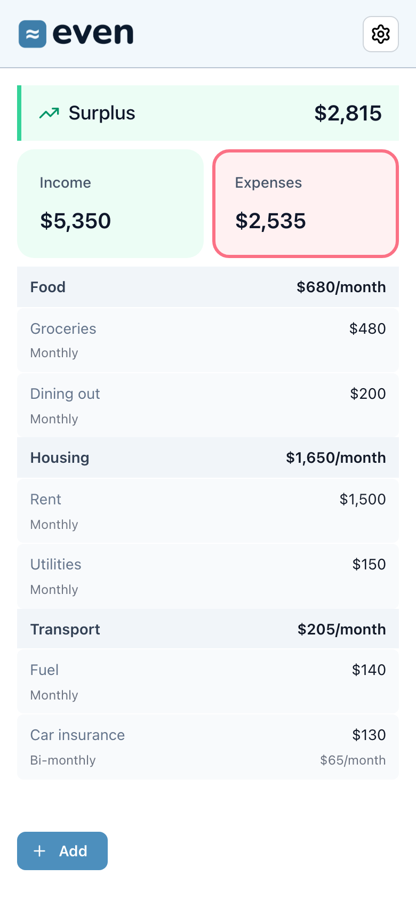

# Even

A personal budget planner for allocating your monthly income.

No expense tracking, no account, no signup; your data stays in your browser.

<p align="center">
  
</p>

**Live App:** [even.gonnanav.com](https://even.gonnanav.com/)

## Features

- **Income & expenses** — add items and see running totals; optionally group related ones with category labels
- **Frequency normalization** — enter items as monthly or bi-monthly; amounts are normalized to a comparable monthly figure
- **Balance** — see whether you're in surplus, deficit, or even
- **Currency** — pick from any locale currency; amounts are relabeled, not converted
- **Backup & restore** — export your budget to a JSON file and import it back
- **Local storage** — your data is stored in your browser (IndexedDB)
- **PWA** — installable and usable offline

## Tech Stack

React 19 + Mantine, Dexie (IndexedDB) for local storage, built with Vite and deployed to Cloudflare Workers.

## Getting Started

1. **Clone the repository**

   ```bash
   git clone https://github.com/gonnanav/even.git
   cd even
   ```

2. **Install dependencies**

   ```bash
   npm install
   ```

3. **Start the development server**

   ```bash
   npm run dev
   ```

4. **Open your browser**

   Navigate to [http://localhost:5173](http://localhost:5173)

## Development

```bash
npm run typecheck   # Type check
npm run lint        # Lint
npm test            # Unit tests
npm run test:e2e    # End-to-end tests
npm run build       # Production build
```

## License

Source-available, all rights reserved. You're welcome to read the code, but it isn't licensed for reuse, redistribution, or self-hosting.

